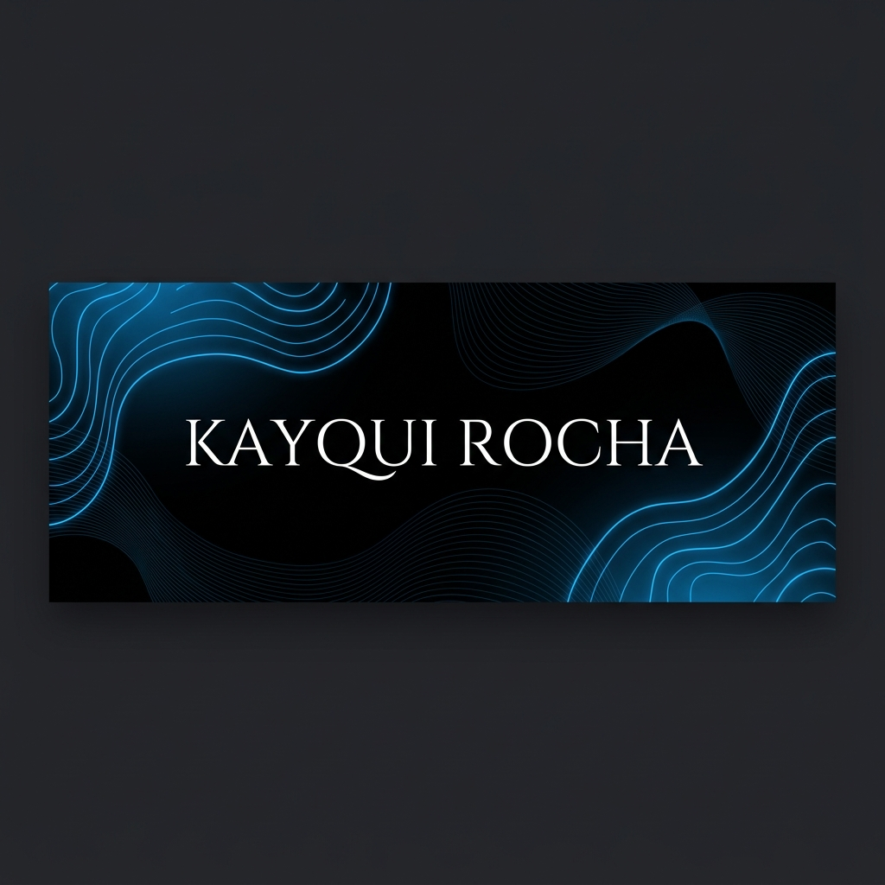

# ⚡ Kayqui Rocha Godinho

  

### Full-Stack Software Engineer & NTG Athlete (Wrestling)

  
  

---

## 🤼‍♂️ A Dualidade: Tatame & Teclado

> "No wrestling não há atalhos; cada vitória é conquistada com repetição exaustiva. No código é igual: sistemas complexos nascem do commit persistente."

Sou desenvolvedor **Full-Stack** focado em arquiteturas de alto rendimento, automações cognitivas com IA e integrações resilientes. Em paralelo, sou atleta competidor de **Wrestling** (Luta Olímpica) pela equipe NTG, Medalhista de Bronze no Campeonato Brasileiro Sub-18 (Série Ouro) e Vice-Campeão Paulista.

---

## 🛠️ Arsenal Tecnológico

### Frontend & UI

### Backend & Databases

### Automação & DevOps

---

## 📊 Estatísticas do GitHub

  
  

  

---

## 🐍 Minha Grade de Contribuições (Jogo da Cobrinha!)

  <picture>
    <source media="(prefers-color-scheme: dark)" srcset="https://raw.githubusercontent.com/Kayqui-Dev/Kayqui-Dev/output/github-contribution-grid-snake-dark.svg">
    <source media="(prefers-color-scheme: light)" srcset="https://raw.githubusercontent.com/Kayqui-Dev/Kayqui-Dev/output/github-contribution-grid-snake.svg">
    
  </picture>

---

## 🎯 Conquistas Recentes
- 🥉 **3º Lugar** - Campeonato Brasileiro JEB's Sub-18 de Wrestling (Série Ouro, -60kg)
- 🥈 **Vice-Campeão Paulista** - Wrestling (CBW)
- 💼 **Fundador** - Kodava Solutions (Automações inteligentes & IA)
- 💻 **Full-Stack Developer** - VTP

